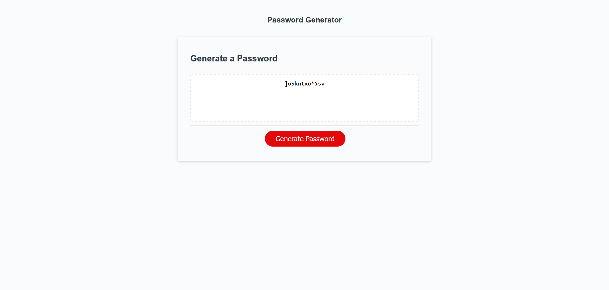

# Password-Gen

Password Generator

## Description
A simple password generator that prompts the user in window with four different confirm messages on what kind of characters they want in the password. The user also has to enter a number between 8-128 which is used to mark down how many characters the password will be.

## Installation

N/A

## Screenshots

## Usage
 The user can choose between lowercase, uppercase, numerical numbers, and special characters and is also required to input a number between 8 and 128. Once the requirements are met a password is generated based on the combination of the choices made. The password is then written on the screen.

## Credits

Ediubong Ekwere | Juno and Ice\
Joey Lee | Rockojoe2

## License

MIT © Juno and Ice